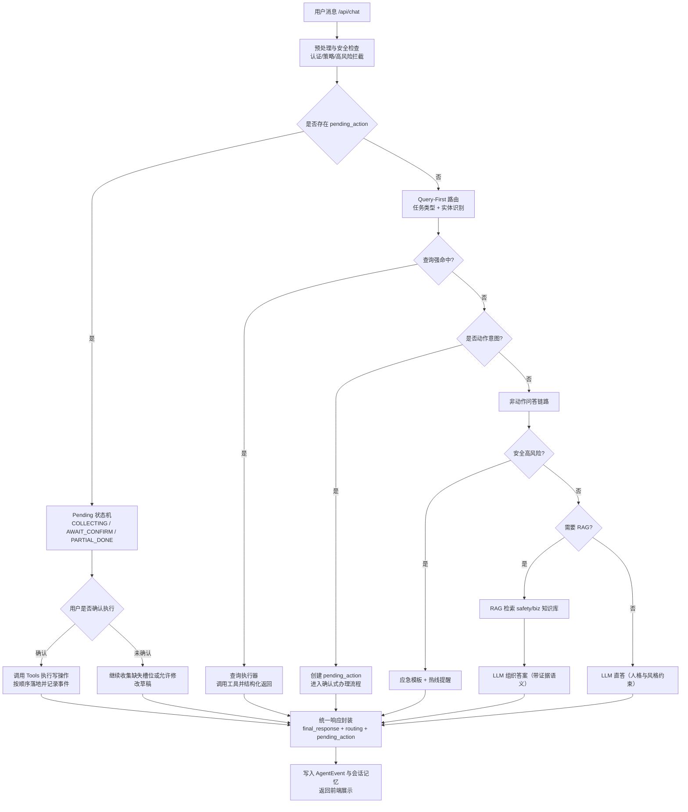

# LPG-AI-Agent-Platform

基于 `Django + DRF + React(Vite)` 的LPG客服与用户门户系统。项目重心在 Agent 对话质量、可执行工具链路与安全可控的业务编排。

## 1. 项目结构
- `backend/`: Django 服务端（API、Agent 编排、Portal 业务、知识库检索）
- `frontend/`: React 前端（Portal 页面、聊天界面、订单/地址管理）
- `docs/`: 方案、API、测试与架构文档
- `spec/`: 规范与质量分析文档
- `lpg_qwen25_7b_lora_adapter/`: 附带的 LoRA 微调适配器（实验用途）
- `qwen25_7b_lpg_train_data_1000.jsonl`: 微调训练样本（脱敏示例数据）
- `qwen25_7b_lpg_train_data_quality_report.json`: 训练数据质量报告

## 2. 附带微调模型说明
仓库里附带了一个轻量微调资产，主要用于客服语气与领域表达实验，不作为生产默认模型强依赖。

- 类型：Qwen2.5-7B 的 LoRA 适配器（目录：`lpg_qwen25_7b_lora_adapter/`），只用了1000条训练样本，效果有限（qwen25_7b_lpg_train_data_1000.jsonl），该模型适用于v1路径，有较多的兜底策略，效果不佳
- 用途：增强燃气客服场景下的术语表达、回复风格一致性
- 当前定位：可选实验组件。线上主链路仍以规则编排 + 工具调用 + 可替换 LLM 为主
- 建议：把微调模型作为“回复风格增强层”，不要绕过业务规则和写操作确认机制

## 3. 智能客服功能（当前可用）
- 查询类：地址列表、订单列表/详情、通知、资料
- 办理类：下单、改址、支付、取消、地址管理、购物车操作
- 组合需求：支持“配件 + 上门服务”一条消息识别并串行执行
- 安全问答：区分日常安全、检漏判断、高风险应急
- 人工客服：支持人工排队状态（前方人数/预计时长）与排队中继续问答
- 记忆能力：保留对话上下文与 pending action 状态，实现多轮补充后执行

## 4. 智能客服设计详解
### 4.1 设计目标
- 对话不只“能聊”，而是“能办事”
- 写操作必须确认，避免误操作
- 高风险安全场景优先级最高
- 全链路可审计、可复盘

### 4.2 编排主链路（Portal V2）
入口是 `/api/chat`，核心在 `backend/agent/portal_orchestrator.py`。

主流程：
1. 预处理与安全/策略检查（只读兜底、禁操作拦截等）
2. Query-First 与意图路由（先判任务类型，再判实体）
3. 若存在 `pending_action`，进入收集/确认/执行状态机
4. 需要工具时走 `backend/agent/tools.py`
5. 非动作问答走 LLM 直答或 RAG（按主题与风险选择）
6. 输出 `routing` + `pending_action` + `final_response`

### 4.3 状态机与“能办理”机制
通过 `pending_action` 驱动办理流程，而不是一次性自由生成：
- `COLLECTING`: 收集缺失槽位（地址、联系方式、服务类型等）
- `AWAIT_CONFIRM`: 已整理摘要，等待“确认/取消”
- `PARTIAL_DONE`: 组合动作部分成功，支持只重试未完成步骤

这套机制保证：
- 用户一句话可发起复杂任务
- 多轮补充后仍保持目标不丢失
- 写操作必须确认

### 4.4 路由策略
- Query-First：强查询句优先走工具，避免掉到泛化回答
- Ambiguity 管理：不明确时做定向澄清，明确后立刻执行
- Topic continuation：如“燃气安全 -> 餐饮”，短回复会按上文主题续答，不再回退通用分流

### 4.5 RAG 与知识边界
知识库按域分离：
- `safety_docs/`: 安全与应急规范
- `biz_docs/`: 业务规则（价格、发票、年检、服务时段等）

策略：
- 强事实问题优先检索
- 非高风险通用问题可 LLM 直答
- 高风险安全问题走应急模板与热线提醒

### 4.6 风控与安全优先
- 高风险关键词触发应急链路（先安全动作，再热线）
- 危险操作建议（拆改、绕过安全装置）做明确拒答
- 地址/订单等写操作全部要求显式确认

### 4.7 可观测性
每次对话会记录 run/event，用于回放与审计：
- 路由选择
- 工具调用输入输出
- 回答来源（LLM/RAG/模板兜底）
- 状态转移

### 4.8 前端页面说明
当前前端页面是“功能优先”的实现，视觉层较简单，主要用于快速验证 Agent 能力与业务闭环。

页面现状：
- 覆盖核心流程（聊天、订单、地址、通知）
- 便于联调和回归测试
- 交互和视觉仍可继续工程化优化（设计系统、组件统一、可访问性、移动端细节）

### 4.9 Agent 架构设计（消息处理流程）
核心组件分层：
- `API 接入层`：接收 `/api/chat` 请求，校验用户态与参数。
- `编排层 (portal_orchestrator)`：统一做路由、状态机推进、策略控制。
- `能力层 (tools + services)`：执行查询和写操作（地址、订单、购物车、通知等）。
- `知识层 (RAG)`：在需要事实依据时检索业务/安全知识库。
- `生成层 (LLM)`：负责自然语言表达，不直接越权执行写操作。
- `记忆与审计`：会话记忆（memory_json）与 AgentEvent 事件链回放。

下面是收到一条用户消息后的处理流程（Mermaid）：



## 5. 快速启动（本地）
### 5.1 后端
```bash
cd backend
python -m venv .venv
# Windows:
.venv\Scripts\activate
# macOS/Linux:
# source .venv/bin/activate

pip install -r requirements.txt
python manage.py migrate
python manage.py runserver
```

### 5.2 前端
```bash
cd frontend
npm install
npm run dev
```

默认本地地址：
- 后端：`http://localhost:8000`
- 前端：`http://localhost:5173`

## 6. 测试命令（推荐）
```bash
python backend/manage.py test
```

只验证 Portal V2 关键链路：
```bash
python backend/manage.py test agent.tests.test_portal_mode_chat agent.tests.test_portal_mode_chat_rag_memory
```

## 7. RAG / 知识库
重建索引示例：
```bash
cd backend
python manage.py rebuild_kb --domain safety --force
python manage.py rebuild_kb --domain biz --force
```


## 10. 相关文档
- Portal API：`docs/portal_api.md`
- 路由/对话改造方案：`docs/agent_routing_v2_plan.md`
- 测试与质量：`docs/dialog_quality_testkit.md`
- 后端说明：`backend/README.md`
